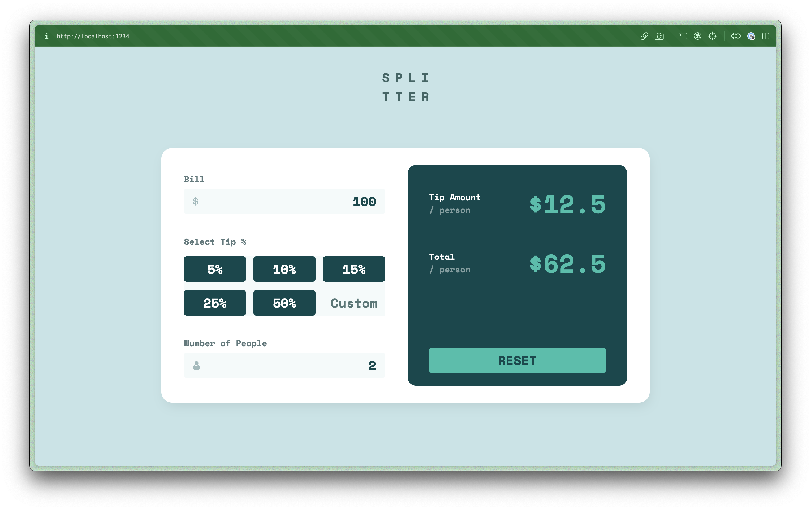
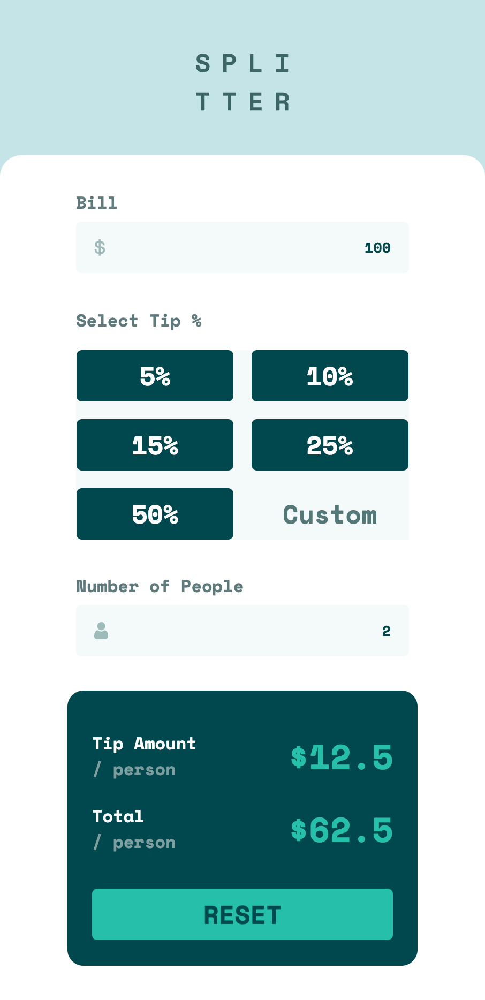

# Frontend Mentor - Tip app challenge

> Resolução do desafio [Tip Calculator](www.frontendmentor.io/challenges/tip-calculator-app-ugJNGbJUX)

## Table of contents

- [Links](#links)
- [Built with](#built-with)
- [Author](#author)

## Desktop

---

## Mobile

---

### Links

- URL: [Preview](https://gsscruz.github.io/tip_calculator/)

### Built with

- Semantic HTML5 markup
- CSS3
- Mobile-first workflow
- Typescript

### **Autor**

- Demais desafios realizados na plataforma - [Demais trabalhos](https://www.frontendmentor.io/profile/gsscruz)
